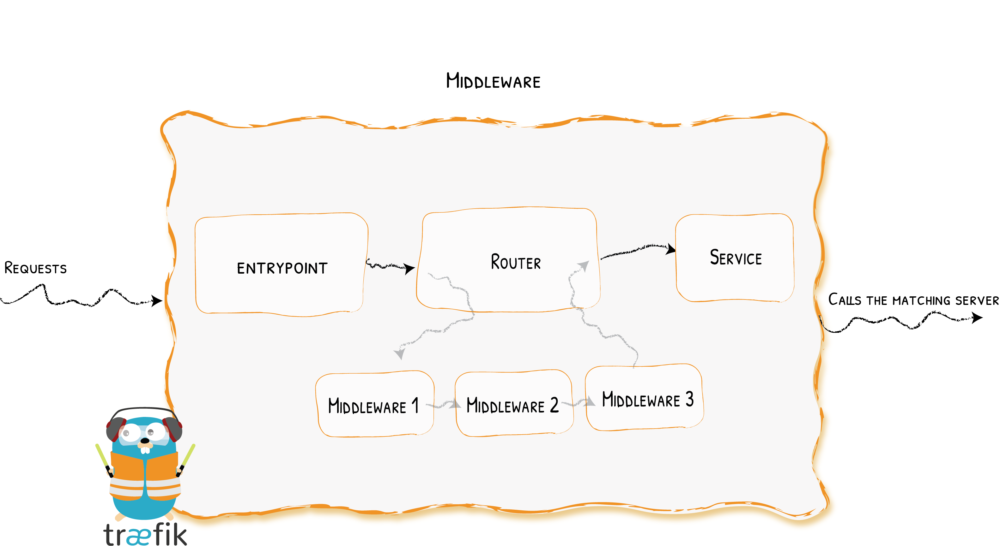

import Tabs from '@theme/Tabs';
import TabItem from '@theme/TabItem';

# HTTP Middlewares

Controlling connections
{: .subtitle }



## Configuration Example

<Tabs groupId="configuration-example">
<TabItem value="Docker">

```yaml
# As a Docker Label
whoami:
  #  A container that exposes an API to show its IP address
  image: traefik/whoami
  labels:
    # Create a middleware named `foo-add-prefix`
    - "traefik.http.middlewares.foo-add-prefix.addprefix.prefix=/foo"
    # Apply the middleware named `foo-add-prefix` to the router named `router1`
    - "traefik.http.routers.router1.middlewares=foo-add-prefix@docker"
```

</TabItem>
<TabItem value="Kubernetes">

```yaml
# As a Kubernetes Traefik IngressRoute
apiVersion: apiextensions.k8s.io/v1beta1
kind: CustomResourceDefinition
metadata:
  name: middlewares.traefik.containo.us
spec:
  group: traefik.containo.us
  version: v1alpha1
  names:
    kind: Middleware
    plural: middlewares
    singular: middleware
  scope: Namespaced

---
apiVersion: traefik.containo.us/v1alpha1
kind: Middleware
metadata:
  name: stripprefix
spec:
  stripPrefix:
    prefixes:
      - /stripit

---
apiVersion: traefik.containo.us/v1alpha1
kind: IngressRoute
metadata:
  name: ingressroute
spec:
# more fields...
  routes:
    # more fields...
    middlewares:
      - name: stripprefix
```

</TabItem>
<TabItem value="Consul Catalog">

```yaml
# Create a middleware named `foo-add-prefix`
- "traefik.http.middlewares.foo-add-prefix.addprefix.prefix=/foo"
# Apply the middleware named `foo-add-prefix` to the router named `router1`
- "traefik.http.routers.router1.middlewares=foo-add-prefix@consulcatalog"
```

</TabItem>
<TabItem value="Marathon">

```json
"labels": {
  "traefik.http.middlewares.foo-add-prefix.addprefix.prefix": "/foo",
  "traefik.http.routers.router1.middlewares": "foo-add-prefix@marathon"
}
```

</TabItem>
<TabItem value="Rancher">

```yaml
# As a Rancher Label
labels:
  # Create a middleware named `foo-add-prefix`
  - "traefik.http.middlewares.foo-add-prefix.addprefix.prefix=/foo"
  # Apply the middleware named `foo-add-prefix` to the router named `router1`
  - "traefik.http.routers.router1.middlewares=foo-add-prefix@rancher"
```

</TabItem>
<TabItem value="File (YAML)">

```yaml
# As YAML Configuration File
http:
  routers:
    router1:
      service: service1
      middlewares:
        - "foo-add-prefix"
      rule: "Host(`example.com`)"

  middlewares:
    foo-add-prefix:
      addPrefix:
        prefix: "/foo"

  services:
    service1:
      loadBalancer:
        servers:
          - url: "http://127.0.0.1:80"
```

</TabItem>
<TabItem value="File (TOML)">

```toml
# As TOML Configuration File
[http.routers]
  [http.routers.router1]
    service = "service1"
    middlewares = ["foo-add-prefix"]
    rule = "Host(`example.com`)"

[http.middlewares]
  [http.middlewares.foo-add-prefix.addPrefix]
    prefix = "/foo"

[http.services]
  [http.services.service1]
    [http.services.service1.loadBalancer]

      [[http.services.service1.loadBalancer.servers]]
        url = "http://127.0.0.1:80"
```

</TabItem>
</Tabs>

## Available HTTP Middlewares

| Middleware                                | Purpose                                           | Area                        |
|-------------------------------------------|---------------------------------------------------|-----------------------------|
| [AddPrefix](addprefix.md)                 | Adds a Path Prefix                                | Path Modifier               |
| [BasicAuth](basicauth.md)                 | Adds Basic Authentication                         | Security, Authentication    |
| [Buffering](buffering.md)                 | Buffers the request/response                      | Request Lifecycle           |
| [Chain](chain.md)                         | Combines multiple pieces of middleware            | Misc                        |
| [CircuitBreaker](circuitbreaker.md)       | Prevents calling unhealthy services               | Request Lifecycle           |
| [Compress](compress.md)                   | Compresses the response                           | Content Modifier            |
| [ContentType](contenttype.md)             | Handles Content-Type auto-detection               | Misc                        |
| [DigestAuth](digestauth.md)               | Adds Digest Authentication                        | Security, Authentication    |
| [Errors](errorpages.md)                   | Defines custom error pages                        | Request Lifecycle           |
| [ForwardAuth](forwardauth.md)             | Delegates Authentication                          | Security, Authentication    |
| [Headers](headers.md)                     | Adds / Updates headers                            | Security                    |
| [IPAllowList](ipallowlist.md)             | Limits the allowed client IPs                     | Security, Request lifecycle |
| [InFlightReq](inflightreq.md)             | Limits the number of simultaneous connections     | Security, Request lifecycle |
| [PassTLSClientCert](passtlsclientcert.md) | Adds Client Certificates in a Header              | Security                    |
| [RateLimit](ratelimit.md)                 | Limits the call frequency                         | Security, Request lifecycle |
| [RedirectScheme](redirectscheme.md)       | Redirects based on scheme                         | Request lifecycle           |
| [RedirectRegex](redirectregex.md)         | Redirects based on regex                          | Request lifecycle           |
| [ReplacePath](replacepath.md)             | Changes the path of the request                   | Path Modifier               |
| [ReplacePathRegex](replacepathregex.md)   | Changes the path of the request                   | Path Modifier               |
| [Retry](retry.md)                         | Automatically retries in case of error            | Request lifecycle           |
| [StripPrefix](stripprefix.md)             | Changes the path of the request                   | Path Modifier               |
| [StripPrefixRegex](stripprefixregex.md)   | Changes the path of the request                   | Path Modifier               |

## Community Middlewares

Please take a look at the community-contributed plugins in the [plugin catalog](https://plugins.traefik.io/plugins).

{!traefik-for-business-applications.md!}
