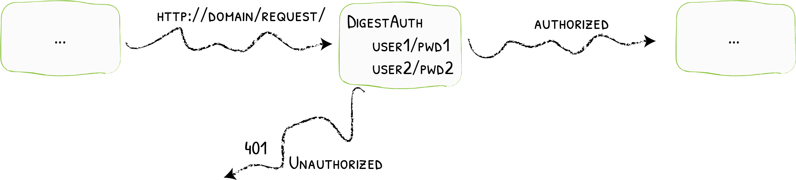

import Tabs from '@theme/Tabs';
import TabItem from '@theme/TabItem';

# DigestAuth

Adding Digest Authentication
{: .subtitle }



The DigestAuth middleware restricts access to your services to known users.

## Configuration Examples

<Tabs groupId="configuration-example">
<TabItem value="Docker">

```yaml
# Declaring the user list
labels:
  - "traefik.http.middlewares.test-auth.digestauth.users=test:traefik:a2688e031edb4be6a3797f3882655c05,test2:traefik:518845800f9e2bfb1f1f740ec24f074e"
```

</TabItem>
<TabItem value="Kubernetes">

```yaml
# Declaring the user list
apiVersion: traefik.containo.us/v1alpha1
kind: Middleware
metadata:
  name: test-auth
spec:
  digestAuth:
    secret: userssecret
```

</TabItem>
<TabItem value="Consul Catalog">

```yaml
# Declaring the user list
- "traefik.http.middlewares.test-auth.digestauth.users=test:traefik:a2688e031edb4be6a3797f3882655c05,test2:traefik:518845800f9e2bfb1f1f740ec24f074e"
```

</TabItem>
<TabItem value="Marathon">

```json
"labels": {
  "traefik.http.middlewares.test-auth.digestauth.users": "test:traefik:a2688e031edb4be6a3797f3882655c05,test2:traefik:518845800f9e2bfb1f1f740ec24f074e"
}
```

</TabItem>
<TabItem value="Rancher">

```yaml
# Declaring the user list
labels:
  - "traefik.http.middlewares.test-auth.digestauth.users=test:traefik:a2688e031edb4be6a3797f3882655c05,test2:traefik:518845800f9e2bfb1f1f740ec24f074e"
```

</TabItem>
<TabItem value="File (YAML)">

```yaml
# Declaring the user list
http:
  middlewares:
    test-auth:
      digestAuth:
        users:
          - "test:traefik:a2688e031edb4be6a3797f3882655c05"
          - "test2:traefik:518845800f9e2bfb1f1f740ec24f074e"
```

</TabItem>
<TabItem value="File (TOML)">

```toml
# Declaring the user list
[http.middlewares]
  [http.middlewares.test-auth.digestAuth]
    users = [
      "test:traefik:a2688e031edb4be6a3797f3882655c05",
      "test2:traefik:518845800f9e2bfb1f1f740ec24f074e",
    ]
```

</TabItem>
</Tabs>

## Configuration Options

:::tip

Use `htdigest` to generate passwords.

:::

:::tip Use `htdigest` to generate passwords.
:::

### `users`

The `users` option is an array of authorized users. Each user will be declared using the `name:realm:encoded-password` format.

:::note
- If both `users` and `usersFile` are provided, the two are merged. The contents of `usersFile` have precedence over the values in `users`.
- For security reasons, the field `users` doesn't exist for Kubernetes IngressRoute, and one should use the `secret` field instead.
:::

<Tabs groupId="configuration-example">
<TabItem value="Docker">

```yaml
labels:
  - "traefik.http.middlewares.test-auth.digestauth.users=test:traefik:a2688e031edb4be6a3797f3882655c05,test2:traefik:518845800f9e2bfb1f1f740ec24f074e"
```

</TabItem>
<TabItem value="Kubernetes">

```yaml
apiVersion: traefik.containo.us/v1alpha1
kind: Middleware
metadata:
  name: test-auth
spec:
  digestAuth:
    secret: authsecret

---
apiVersion: v1
kind: Secret
metadata:
  name: authsecret
  namespace: default

data:
  users: |2
    dGVzdDp0cmFlZmlrOmEyNjg4ZTAzMWVkYjRiZTZhMzc5N2YzODgyNjU1YzA1CnRlc3QyOnRyYWVmaWs6NTE4ODQ1ODAwZjllMmJmYjFmMWY3NDBlYzI0ZjA3NGUKCg==
```

</TabItem>
<TabItem value="Consul Catalog">

```yaml
- "traefik.http.middlewares.test-auth.digestauth.users=test:traefik:a2688e031edb4be6a3797f3882655c05,test2:traefik:518845800f9e2bfb1f1f740ec24f074e"
```

</TabItem>
<TabItem value="Marathon">

```json
"labels": {
  "traefik.http.middlewares.test-auth.digestauth.users": "test:traefik:a2688e031edb4be6a3797f3882655c05,test2:traefik:518845800f9e2bfb1f1f740ec24f074e"
}
```

</TabItem>
<TabItem value="Rancher">

```yaml
labels:
  - "traefik.http.middlewares.test-auth.digestauth.users=test:traefik:a2688e031edb4be6a3797f3882655c05,test2:traefik:518845800f9e2bfb1f1f740ec24f074e"
```

</TabItem>
<TabItem value="File (YAML)">

```yaml
http:
  middlewares:
    test-auth:
      digestAuth:
        users:
          - "test:traefik:a2688e031edb4be6a3797f3882655c05"
          - "test2:traefik:518845800f9e2bfb1f1f740ec24f074e"
```

</TabItem>
<TabItem value="File (TOML)">

```toml
[http.middlewares]
  [http.middlewares.test-auth.digestAuth]
    users = [
      "test:traefik:a2688e031edb4be6a3797f3882655c05",
      "test2:traefik:518845800f9e2bfb1f1f740ec24f074e",
    ]
```

</TabItem>
</Tabs>

# AZERTY
## AZERTY
### AZERTY
#### AZERTY
##### AZERTY
###### AZERTY
####### AZERTY

# QWERTY
## QWERTY
### QWERTY
#### QWERTY
##### QWERTY
###### QWERTY
####### QWERTY

# DVORAK
## DVORAK
### DVORAK
#### DVORAK
##### DVORAK
###### DVORAK
####### DVORAK

# THIS IS A VERY LONG HEADING THAT TAKES TO MUCH PLACE
## THIS IS A VERY LONG HEADING THAT TAKES TO MUCH PLACE
### THIS IS A VERY LONG HEADING THAT TAKES TO MUCH PLACE
#### THIS IS A VERY LONG HEADING THAT TAKES TO MUCH PLACE
##### THIS IS A VERY LONG HEADING THAT TAKES TO MUCH PLACE
###### THIS IS A VERY LONG HEADING THAT TAKES TO MUCH PLACE
####### THIS IS A VERY LONG HEADING THAT TAKES TO MUCH PLACE
